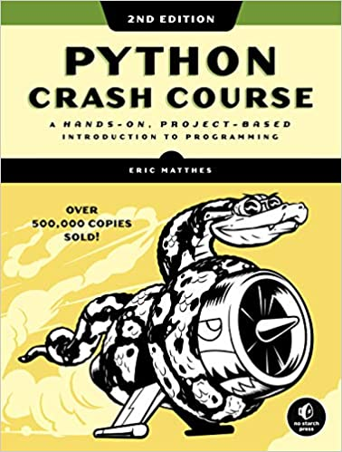

Python Crash Course - Second Edition
===

A Hands-On, Project-Based Introduction to Programming
---

This is a collection of resources for [Python Crash Course, Second Edition](http://www.nostarch.com/pythoncrashcourse/), an introductory programming book from [No Starch Press](http://www.nostarch.com) by Eric Matthes. Click here for a [much cleaner version](https://ehmatthes.github.io/pcc_2e/) of these online resources.

If you have any questions about Python Crash Course, feel free to get in touch:

Here you can find instructions for:

- [Installing and configuring Python](http://ehmatthes.github.io/pcc/chapter_01/README.html) (Chapter 1)
- [Installing and using pip](http://ehmatthes.github.io/pcc/chapter_12/installing_pip.html) (Chapter 12)
- [Installing Pygame](http://ehmatthes.github.io/pcc/chapter_12/README.html) (Chapter 12)
- [Installing matplotlib and Pygal](http://ehmatthes.github.io/pcc/chapter_15/README.html) (Chapter 15)
- [Creating a Virtual Environment](http://ehmatthes.github.io/pcc/chapter_18/README.html) (Chapter 18)
- [Deploying a Project to Heroku](http://ehmatthes.github.io/pcc/chapter_20/README.html) (Chapter 20)
- [Installing Python](http://ehmatthes.github.io/pcc/appendix_a/README.html) (Appendix A)

